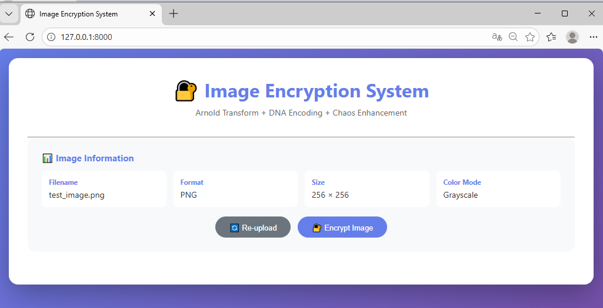
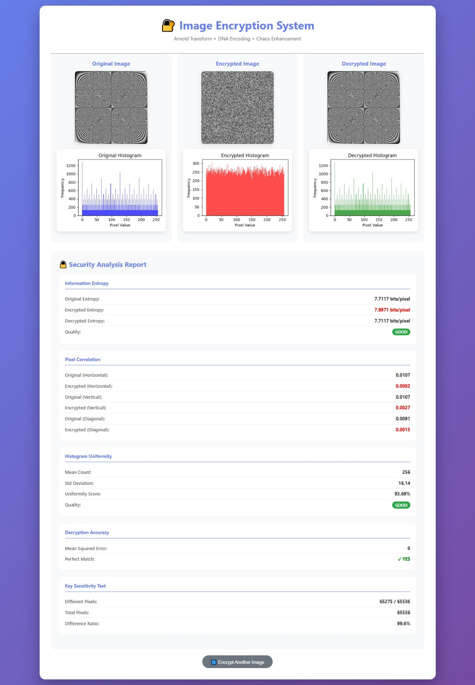
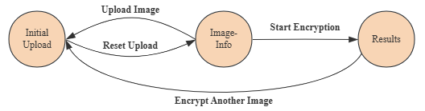

# Chaos-DNA Image Encryption System

A multi-layer grayscale image encryption system combining Arnold Cat Map, DNA Encoding, and Logistic Chaos Map. Includes a FastAPI web backend with an HTML/JS frontend for interactive use, and a multi-threaded batch benchmarking script validated against the USC-SIPI Image Database.

---

## Project Overview

This project implements a three-layer image encryption pipeline:

1. **Arnold Cat Map** scrambles pixel positions through iterative geometric permutation
2. **DNA Encoding** substitutes pixel values using biologically-inspired base-pair encoding rules
3. **Logistic Chaos Map** generates a pseudo-random keystream to XOR-diffuse pixel values across the entire image

The encrypted output achieves near-maximum entropy (~8 bits/pixel), near-zero pixel correlation, and highly uniform pixel histograms, demonstrating strong resistance to statistical attacks. The encrypted image appears as a visually random, snowflake-like noise pattern, which means all recognizable structure from the original is completely destroyed. Also, A 10⁻¹⁰ perturbation in the initial key produces ~99.60% different ciphertext pixels, confirming high key sensitivity.

---

## Project Structure

```
├── backend/
│   ├── encryption.py          # Core encryption/decryption algorithms
│   ├── preprocessing.py       # Non-square image handling (padding/unpadding)
│   ├── main.py                # FastAPI backend
│   └── test_encrypt.py        # Batch benchmark script (USC-SIPI dataset)
├── frontend/
│   ├── index.html         # Single-page web UI
│   ├── app.js             # Frontend logic
│   └── style.css          # Styling
├── results/
│   ├── aerials_results.csv
│   ├── misc_results.csv
│   ├── sequences_results.csv
│   └── textures_results.csv
├── assets/
│   ├── state-diagram.png
│   ├── screenshot-upload.png
│   └── screenshot-results.png
└── test_image.png         # Sample input image for testing
```

---

## Part 1: Encryption Algorithm

### 1.1 Arnold Cat Map (Pixel Scrambling)

The Arnold Cat Map is a 2D area-preserving map that permutes pixel coordinates. Applied iteratively, it thoroughly shuffles spatial structure while remaining fully reversible.

```
[x']   [1  1] [x]
[y'] = [1  2] [y]  mod N
```

The transform is applied `arnold_iterations` times. Decryption applies the inverse transform the same number of times. Since the map is periodic, a sufficiently large iteration count ensures the pixel layout bears no resemblance to the original.

### 1.2 DNA Encoding (Value Substitution)

Each pixel byte is split into four 2-bit pairs. Each pair is mapped to a DNA base (A, T, G, C) according to one of 24 standard encoding rules. A chaos-derived key image is encoded in the same way, and base-level XOR is performed between the two. The result is then decoded back to pixel values using the same rule. This step introduces non-linearity and value-level diffusion.

### 1.3 Logistic Chaos Map (Diffusion)

A pseudo-random sequence is generated from the logistic map:

```
x_{n+1} = r * x_n * (1 - x_n)
```

With `r` close to 4 and a non-trivial initial value `x0`, the sequence is highly sensitive to initial conditions and statistically indistinguishable from random noise. The sequence is reshaped into a key matrix and XOR-applied to the DNA-encoded image, breaking any remaining inter-pixel correlation.

### Encryption Parameters

| Parameter | Default | Description |
|---|---|---|
| `arnold_iterations` | 80 | Number of Arnold Cat Map iterations |
| `dna_rule` | 2 | DNA encoding rule index (0–7) |
| `chaos_x0` | 0.123456789 | Logistic map initial value |
| `chaos_r` | 3.9876 | Logistic map growth rate |

---

## Part 2: System Implementation

### FastAPI Backend

The backend is built with FastAPI and exposes two main endpoints. Images are held in memory between the upload and encrypt steps. Non-square images are automatically zero-padded to the nearest square before encryption and cropped back after decryption, with no loss of original content.

### Web Interface

The frontend provides a three-state single-page workflow:

- **Upload** — Select any PNG, JPG, BMP, or TIFF image
- **Encrypt** — One-click encryption with a loading indicator
- **Results** — Side-by-side display of the original, encrypted, and decrypted images alongside their pixel histograms, and a full security analysis report

**Upload Interface**


**Encryption Results**


The security analysis report includes information entropy (with quality badge), pixel correlation in horizontal/vertical/diagonal directions, histogram uniformity score, decryption accuracy (MSE and perfect match check), and a key sensitivity test showing the pixel difference ratio when the initial key is perturbed by 10⁻¹⁰.

The frontend provides a three-state single-page workflow:



### API Reference

**`POST /api/upload`**
Upload an image file. Returns `image_id`, filename, format, dimensions, color mode, and a base64 preview of the grayscale image.

**`POST /api/encrypt`**
Accepts `image_id` and encryption parameters. Returns base64-encoded original, encrypted, and decrypted images, histogram images, and the full security analysis including entropy, correlation, histogram uniformity, decryption accuracy, and key sensitivity results.

**`GET /health`**
Health check endpoint.

---

## Part 3: How to Run

### Prerequisites

```bash
pip install fastapi uvicorn numpy pillow matplotlib pywavelets opencv-python tqdm
```

### Run the Web Application

```bash
uvicorn main:app --host 0.0.0.0 --port 8000
```

Open `http://localhost:8000` in your browser.

### Run Batch Benchmarks

Edit the `test_set` and `input_dir` variables in `test_encrypt.py` to point to your local copy of the USC-SIPI dataset, then:

```bash
python test_encrypt.py
```

Results are saved to `<test_set>_results.csv`.

---

## Part 4: Benchmark Results

Tested on 210 images across four categories of the [USC-SIPI Image Database](https://sipi.usc.edu/database/). All images decrypted with 100% perfect match (MSE = 0 in every case).

| Dataset | Images | Entropy mean | Uniformity mean | Corr H mean | Corr V mean | Corr D mean | Perfect Match |
|---|---|---|---|---|---|---|---|
| Aerials | 38 | 7.9997 | 97.97% | 0.0334 | 0.0000 | 0.0002 | 38/38 |
| Misc    | 39 | 7.9986 | 95.85% | 0.0038 | 0.0001 | -0.0013 | 39/39 |
| Sequences | 69 | 7.9975 | 94.26% | -0.0255 | -0.0006 | -0.0001 | 69/69 |
| Textures  | 64 | 7.9995 | 97.49% | 0.0202  | 0.0000 | -0.0001 | 64/64 |

**Metrics:**
- **Entropy** — Measures the randomness of pixel value distribution. Theoretical maximum is 8.0 bits/pixel. All datasets average above 7.997.
- **Histogram Uniformity** — Measures how evenly pixel values are distributed in the ciphertext. Values above 70% are considered strong; all datasets exceed 94%.
- **Pixel Correlation (H/V/D)** —Measures spatial redundancy between horizontally, vertically, and diagonally adjacent pixels. Ideal is 0.0; all datasets are within ±0.035.
- **Perfect Match** — The decrypted image is bit-identical to the original in every test case.

Full per-image results are available in the `results/` directory.

---

## License

MIT License. See `LICENSE` for details.

---

## Acknowledgements

Benchmark dataset: [USC-SIPI Image Database](https://sipi.usc.edu/database/), University of Southern California. Encryption design inspired by published literature on chaos-based image cryptography and DNA computing.
